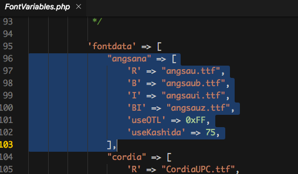
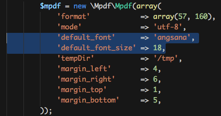

# Mpdf ตั่งค่าฟอนต์ภาษาไทยและสระไม่ลอย
## สามารถทำได้ดังนี้

- นำฟอนต์ .ttf มาใส่ /vendor/mpdf/mpdf/ttfonts
	หมายเหตุในตัวอย่างจะใช้ font [angsana new](assets/angsau.zip)
- เปิดไฟล์ /vendor/mpdf/mpdf/src/Config/FontVariables.php
- เพิ่มชื่อฟอนต์ใน array `fontdata`

- ตอนเรียกใช้งาน

 
 

---

 จัดทำโปรแกรมคอมพิวเตอร์พัฒนาระบบงานธุรกิจส่วนตัวและหน่วยงาน ใส่ใจคุณภาพ คุ้มราคา ส่งงานตรงเวลา ติดต่อ 086-288-7987 (ท็อป) หรืออีเมล์    nakomah.web@gmail.com ติดตามผลงานได้ที่ <a href="https://nakomah.com" target="_blank">www.nakomah.com</a>

